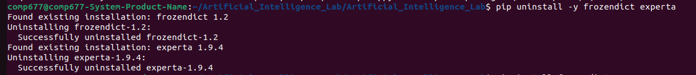

# Rule Based Program Execution Process

Step 1: Run the program on terminal with the command **$ python3 programname**

Step 2: If following error found

-  

Step 3: Resolve the issue as follows:

- Remove the previous installed version of **frondict** and **experta** as follows
  
- 

- Reinstall the required version of **frozendict** as follows

- 

- Use the **experta** instalaltion command as above replacing **frondict**

Step 4: Python code to be tested is as follows:

- 
